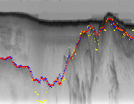
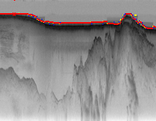
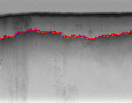
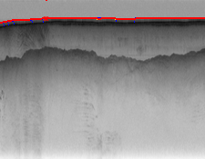
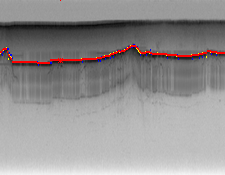
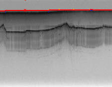

# CSCI-B 551 Assignment 3: Probability and Statistical Learning

Authors: Jacob Striebel (jstrieb), Aishwarya Budhkar (abudhkar), Shubhavi Aryas (aryas)

Date: Wed 1 Dec 2021

## 1. Part-of-Speech Tagging

### 1.1. Problem Formulation
The goal is to implement POS (Part of speech) tagging using Bayes net. Three nets were used as shown in assignment figures a,b and c.  
  
##### Initial probability: Initial probability is the probability of occurrence of a label/POS at the start position.  
Represented as a dictionary with words and their counts occurring at first position.  
Divided by total samples/sentences in training data to get the probability.  
For eg: {noun: 1000, verb:40, ....}  
Divide by total samples to get prob eg P(noun)=1000/10000 = 0.1 if total samples =10000  
If word is not present in training data a very small probability is assigned.  
  
##### Emission probability: Emission probability is the probability of occurrence of a word as a label/POS.  
Represented as a nested dictionary with labels and the words occurring as labels with their counts.  
Divide by the total count of label occurring in the training data to get the probability.  
For eg: {noun: {Car: 400, Tree: 200, ...}, verb:{run:200, jump: 10,...}...}  
If class probability is {noun:1000, verb:2000,...}  
We get P(noun|Car) = 400/1000 = 0.4  
If word is not present in training data a very small probability is assigned.  

##### Transition probability: Transition probability is the probability of transition from one label to another  
Represented as a nested dictionary.  
For eg: {noun:{noun: 10, verb: 800, adv: 600,...},verb:{noun:900,verb:1,...}}  
Divide by the number of times a label is followed by any other label to get the transition probability.  
For instance if prev_follow count = {noun:2000,verb:9000,....}  
We get Transition probability of noun->verb = 800/2000 = 0.4  
  
#### 1.1.1. Simple Model  
With simple model the probability of word only depends on the emission probability. Hence, for each word in sentence,  
the label is decided to be the one which has maximum emission probability of that word among all the labels possible.  
  
To calculate posterior probability of given sentence, simply take the summation of log of emission probability for the given label and word for all the words in the sentence.  
Used laplace smoothing to account for words not present in the training data.  
  
#### 1.1.2. HMM  
Used Viterbi algorithm.  
Construct viterbi and backtrack table.  
In first column we store product of initial and emission probabilities of the word for all labels.  
The next columns are filled as follows:  
Choose the maximum of the products of previous probabilities and transition probability from prev state to current for all labels  
Multiple with emission probability of current word  
Store the index of parent in the backtrack table.  
  
One we fill both viterbi and backtrack table, we get the label associated with maximum probability of last word.  
Then get the parents of that table till we reach the first word.  
Return that label sequence found from first to last word.  
  
For computing posterior probability simple use the labels provided.  
Prob=0  
For first word, Prob+=np.log(initial) + np.log(emission)  
For subsequent words Prob+=np.log(transition_prob(prev->current))+np.log(emission[label][current_word])  
return the prob  
  
#### 1.1.3. Complex HMM  
For complex HMM, used Gibbs sampling similar to what was done in activity 3.  
Joint probability is computed using the Bayes net given in Fig c.  
Basically, *whenever possible*  
prob = 0  
prob = prev_to_prev_to_current_label_transition * prev_to_current_label_transition * prev_to_next_label_transition  
prob* = initial * emission (current label to current word) * emission (prev label to current word)  
  
In gibbs sampling we generate number of samples by changing one variable and keeping all others constant.   
We try to generate samples so that they follow the Bayes net and hence represent the data well.   
The probability is then computed by considering the counts in the sample.   
The label at a position/index who occurred maximum times in the sample is assigned to that position  
  
For posterior probability simple use the joint probability structure to compute probability of each in sample.  
Add the log likelihoods.  
  
### 1.2. How the Program Works  
First use the train data to compute the dictionaries for probability calculations.  
Use the Simple, HMM and complex models as mentioned above to return the labels for the sentences.  
Posterior probabilities are calculated in log space to avoid underflow  
  
### 1.3 Results  
Getting the following results:  

                   Words correct:     Sentences correct: 
    0. Ground truth:    100.00%              100.00%
       1. Simple:       92.91%               43.15%
          2. HMM:       94.85%               54.45%
      1. Complex:       94.44%               51.55%

  
### 1.4. Discussion and Problems faced  
As expected, HMM and complex models outperform simple model.  
Complex and HMM give almost similar results with words.  
  
Major task was understanding computation of probabilities correctly.  
I spent major time debugging mistakes in the calculations.  
Complex HMM understanding especially sampling was tough. In-class activities were very helpful.  
  
## 2. Ice Tracking
   
### 2.1. Problem Formulation   
Here, we need to determine the ice and rock boundaries in the given figures.     
  
#### 2.1.1. Simple Model air  
In simple model we use figure b given in assignment.   
For simple model only emission probabilities matter and not transition.  
For calculating emission probabilities calculate the count of values in file and divide by total rows.  
Hence, the idea is for each column airice boundary will be the topmost row of maximum emission probability i.e. edge strength mask.  
I divide edge strength by 100 otherwise it leads to overflow warning.  
   
With only emission probability, the output was not good so tried to reward a smooth boundary which works much better.  
Thus, along with consideration of max probability, we choose the row only if its within a specified distance from the earlier column max probability row.  
  
#### 2.1.2. Simple Model ice  
In simple model we use figure b given in assignment.  
For simple model only emission probabilities matter and not transition.  
Hence, the idea is for each column icerock boundary will be the topmost row of maximum emission probability i.e. edge strength mask   
conditioned to being greater than distance 10 from airice boundary.  
Again, when conditioned to having a smoother boundary works much better. 
  
I divide edge strength by 100 otherwise it leads to overflow warning.  
  
#### 2.1.3. HMM air  
For this use the Viterbi algorithm.  
Populate the viterbi and backtrack table as follows.  
For first column, use initial probabilities* emission probability for all rows.  
For further rows choose the maximum of previous row probabilities*transition probabilities *emission probability.  
For transition probability, I tried several choices. With trial and error found values which give good boundary.   
Only consider 0-4 distance otherwise transition probability becomes 0.  
Store the index of maximum row as parent in backtrack table.  
  
Once both tables are filled, take maximum of last column.  
Get the parent and backtrack till we reach the first.   
Return the sequence of rows as airice boundary.  
  
#### 2.1.4. HMM ice  
It is very similar to airice boundary. Only condition while deciding the maximum probability,   
is that the distance is airice and icerock boundary should be at least 10 and the boundary should be smooth.  
  
#### 2.1.5. HMM with feedback air    
The idea here is to use viterbi algorithm 2 times.  
Once from start to given point and next from last to given point.  
Initial probability for given point is 1 and for all other rows in that column its 0.  
We fill the viterbi and backtrack table in similar way as mentioned above but we get two sequences.  
Once from 0 to given point and another from given point to end of image.  
We return the entire sequence as boundary.  

#### 2.1.6. HMM with feedback ice  
It is very similar to airice boundary with feedback. Only condition while deciding the maximum probability,  
is that the distance is airice and icerock boundary should be at least 10 and the boundary should be smooth.  
  
### 2.2. How the Program Works  
For each algorithm we calculate the boundaries as mentioned above and then plot them.  
Here the edge strength mask plays a critical role in deciding the strength of values and deciding the probability of presence of boundary.  
  
### 2.3. Discussion and Problems faced  
Getting decent results on the test images provided.  
Major challenge faced was understanding how the edge strength can be used to estimate probabilities.   
Finding transition probability which returns decent output required a lot of trial and error.   
Air ice boundary is easier than icerock. It required a lot of experiments to understand how to use the airice boundary in predicting icerock boundary.  
Also, made the edge strength of aireice boundary detected 0 and passed that as input to icerock viterbi which helped a little.
    
 
  
  

 

 

 

 
## 3. Reading Text  
  
For the optical character recognition (OCR) problem, our simple model achieves 56.2% accuracy on the 20 test images containing 1009 charcters, and our HMM trained on the `bc.train` corpus from part1 achieves 12.4% accuracy on the test images. In this section of our report we describe how we formulated and solved the OCR problem, and then we discuss our results.

### 3.1. Problem Formulation

We formulated the OCR problem as a probabilistic inference problem using a simple Bayes net (Figure 1 (b) in the assignment description document) and using an HMM (Figure 1 (a)). The unobserved random variables are the characters and the evidence variables are the 14 x 25 pixel images.

#### 3.1.1. Simple Model

For the simple approach, we predict each character independently using `argmax_{hidden} P(hidden|evidence)`. We calculate the distribution `P(hidden|evidence)` by first defining the function `Theta(hidden|evidence)` equal to the number of pixels in common between the evidence image and the training image for the hidden character. The Theta function is then normalized to obtain the probability distribution.

#### 3.1.2. HMM

For the HMM approach, we use the HMM formalism given in [1]. `bc.train` provided for part1 is used as the text training file. Words containing out of domain characters in `bc.train` are discarded, and all words are separated by spaces except spaces between words and punctuation are removed.

##### 3.1.2.1. Initial Probability Distribution

The initial probability distribution is calculated over the first character in each sentence in `bc.train`.

##### 3.1.2.2. Transition Probability Matrix

The transition probability matrix is calculated over every character bigram in `bc.train`.

##### 3.1.2.3. Observation Likelihoods

The observation likelihoods are calculated the same way the probability distribution is constructed for the simple model, described in section 3.1.1.

### 3.2. How the Program Works

Before we implemented the two models, we first created gold annotations for the 20 test images. Our program predicts the character sequence contained in each test image using the simple model and using the HMM. The total accuracy of each model on the test data is calculated. Finally, the sequence of characters in the test image file provided on the command line is predicted using each model and printed.

### 3.3. Discussion

One unexpected outcome is that our simple model performs significantly better than our HMM model. It seems that the HMM is dominated by the hidden-state transition probabilities and not influenced by the emission probabilities enough. In order to improve the HMM's performance, we would need a way to tune it to pay more attention to the evidence variables and less to the character bigram probabilities.

## References

[1] Dan Jurafsky and James H. Martin (2021). Appendix A: Hidden Markov Models. Speech and Language Processing, 3rd Ed., preprint, https://web.stanford.edu/~jurafsky/slp3/A.pdf

[2] Stuart Russell and Peter Norvig (2009). Chapter 14: Probabilistic Reasoning. Artificial Intelligence: A Modern Approach, 3rd Ed., Prentice Hall.
